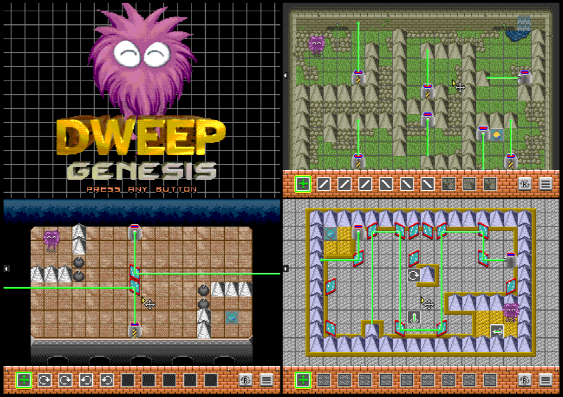

# Dweep Genesis

[](https://jenkins.camargo.eng.br/job/dweep-gen/)

A demake of [Dweep](https://en.wikipedia.org/wiki/Dweep) for the Sega MegaDrive.



## About

This is a work-in-progress SGDK port of the old shareware game Dweep.
The main objective of the project is to be a good C programming exercise,
as well as a way to realize a long-standing desire to code for the Genesis.

Most of the game subsystems are in place, and we have a good base for the game.
Now the focus is on getting the gameplay mechanics and objects working.

Some songs were rearranged using the [Furnace](https://github.com/tildearrow/furnace/) tracker.
Others were converted using libOPNMIDI (midi2vgm), and still need some manual adjustment or a proper arrangement.
SFX was imported straight from the original game.
Art uses [LibreSprite](https://github.com/LibreSprite/LibreSprite) for tilesets and sprites, and [Tiled](https://github.com/mapeditor/tiled) for tilemaps.

The original Dweep was created and programmed by Steve Pavlina, with music by Michael Huang.

<!--ENGBR_SECTION
## Try it Out

```{nostalgistjs}
    :rom_url: "https://jenkins.camargo.eng.br/job/dweep-gen/lastSuccessfulBuild/artifact/ci-build/out/Dweep_Genesis_(latest).bin"
    :core_id: genesis_plus_gx
    {
        "nostalgist_options": {
            "retroarchConfig": {
                "video_smooth": true,
                "input_auto_mouse_grab": true
            }
        },
        "before_launch_preamble": "let efs = nostalgist.getEmscriptenFS(); efs.mkdirTree('/home/web_user/retroarch/userdata/config/remaps/Genesis Plus GX'); efs.writeFile('/home/web_user/retroarch/userdata/config/remaps/Genesis Plus GX/Dweep_Genesis_(latest).rmp',  'input_libretro_device_p1 = \"1\"\\ninput_libretro_device_p2 = \"2\"');"
    }
```
-->

## Download

Download the latest build [here](https://jenkins.camargo.eng.br/job/dweep-gen/lastSuccessfulBuild/artifact/ci-build/out/Dweep_Genesis_(latest).bin).


## Building

For any build method, you will need Python 3 with the `lxml` library.

### Using the CI script

This requires `docker`.
Just run `scripts/ci-build.sh`.
The output will be at `ci-build/out/rom.bin`.
Thanks to doragasu for the docker container script.

### Manually

1. Init and update git submodules (`git submodule update --init`)
2. Run the map processor script beforehand (`./scripts/process_all_maps.sh`).
3. Also run the string processor script (`./scripts/process_strings.sh`).

After this, it should not be different to build than any other SGDK project. Using version 1.90.
After [installing the toolchain](https://github.com/Stephane-D/SGDK/wiki/SGDK-Installation),
check the [usage documentation](https://github.com/Stephane-D/SGDK/wiki/SGDK-Usage).
But in general, running `make -f ${SGDK_LOCATION}/makefile.gen build` should do it.


